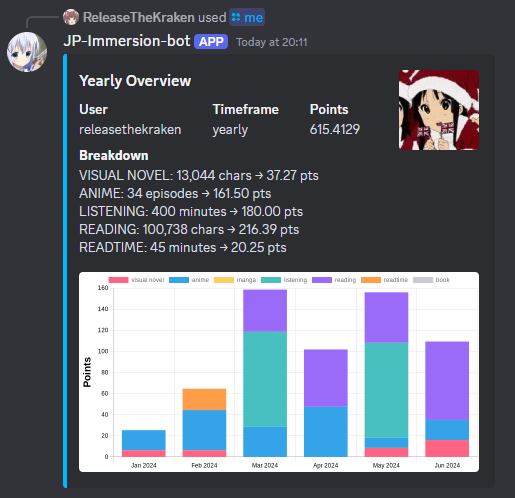

# :japan: Japanese - Immersion Logging/Tracking Discord Bot

A Discord bot for logging/tracking Japanese language learning immersion. Log immersion, earn XP, keep track of your progress and compete in a monthly leaderboard.

## Screenshot Preview

### 📊 Statistics
- Generate graphs of your immersion logs
- Generate by weekly, monthly or yearly



### 📖 Immersion tracking with /log
- Log your immersion time by media type
- Gain XP and compete with others


### 🏆 Leaderboard
- See rankings based on immersion time
- Sort by day, week, or month


## 💾 Installation

Run the following:

```
git clone https://github.com/rtk606/Japanese-immersion-bot.git
cd JP-immersion-bot
npm install
```

Create `config.json` in the root project folder and fill it in:
```
{
  "token": "YOUR_TOKEN_HERE",
  "clientId": "YOUR_CLIENTID_HERE",
  "guildId": "YOUR_GUILDID_HERE"
}
```

You can deploy the commands with:

```
node deploy-commands.js
```

You can start the bot with:

```
node index.js
```


